# Gallery

Every preset in three orientations, rendered by `tests/make_gallery.py`.
The command under each one is what produces that scene: paste it into the
PyMOL command line after loading the system and the protocol.

## Protein presets

Rendered from `prot/4hhb.pdb` with the command shown under each row.

```
load prot/4hhb.pdb
run /path/to/pymol-molviz/molviz.pml
```

### `preset_prot1`

Domain topology. Cartoon by secondary structure: helix blue, sheet red, loop white.

```
preset_prot1
```

| front | 90 deg | 180 deg |
|---|---|---|
| 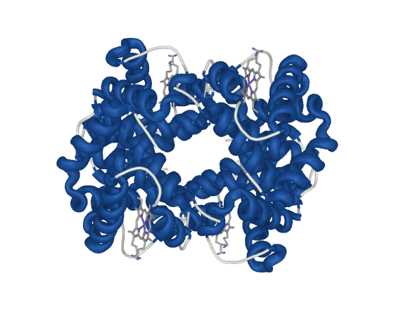 |  | 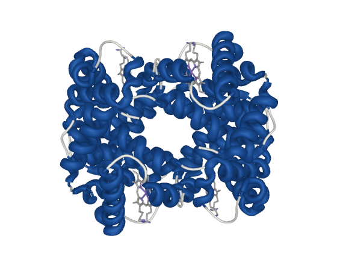 |

### `preset_prot2`

Binding site. Same cartoon under a translucent surface, so a ligand stays visible inside.

```
preset_prot2
```

| front | 90 deg | 180 deg |
|---|---|---|
| 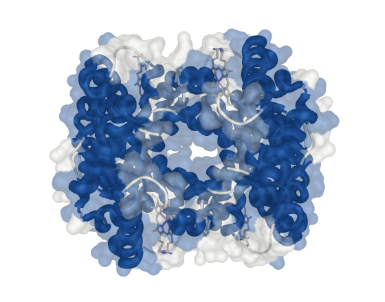 |  | 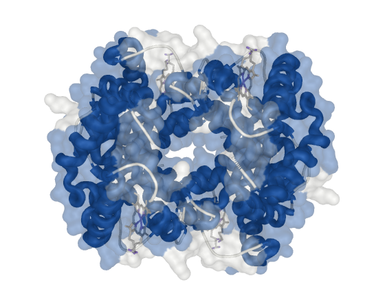 |

### `preset_prot3`

Interaction face. Solid surface with a Kyte-Doolittle gradient. Writes to the B column; `prot_restore_b` undoes it.

```
preset_prot3
```

| front | 90 deg | 180 deg |
|---|---|---|
| 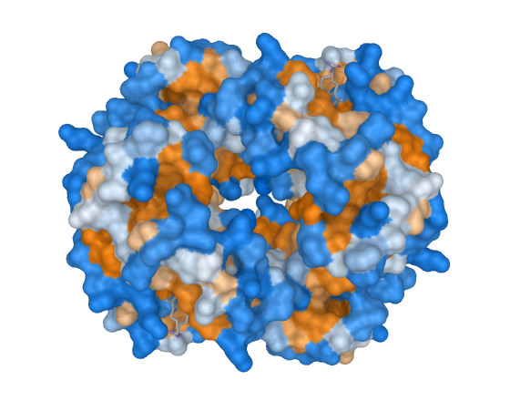 |  | 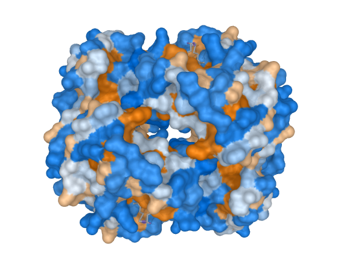 |

### `preset_prot4`

Complex architecture. Spacefill at van der Waals radius, one colour per chain.

```
preset_prot4
```

| front | 90 deg | 180 deg |
|---|---|---|
| 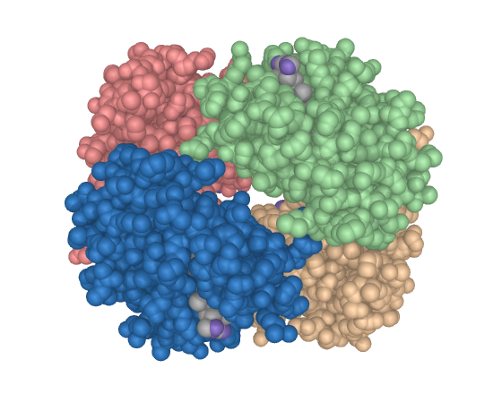 |  | 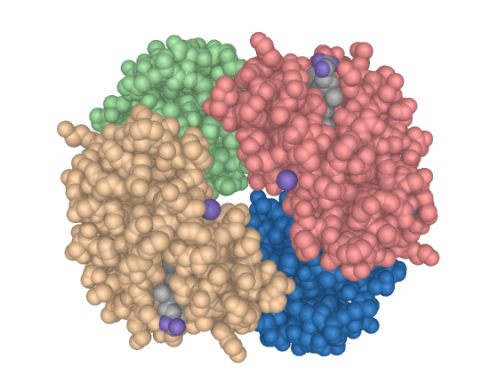 |

### `preset_prot5`

Flexibility. Putty: thickness encodes the B-factor. Inverts on predicted models carrying pLDDT.

```
preset_prot5
```

| front | 90 deg | 180 deg |
|---|---|---|
| 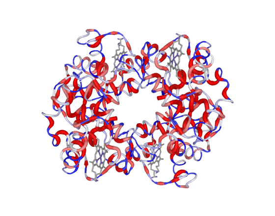 |  | 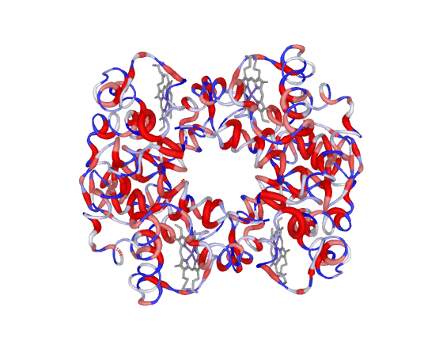 |

### `preset_prot6`

Peptides. All-atom licorice coloured by formal charge. Above 60 residues it warns and stays illegible.

```
preset_prot6
```

| front | 90 deg | 180 deg |
|---|---|---|
| 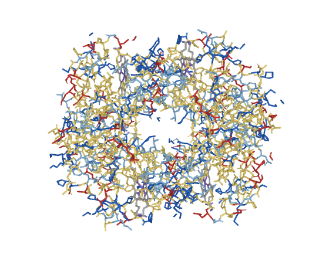 |  | 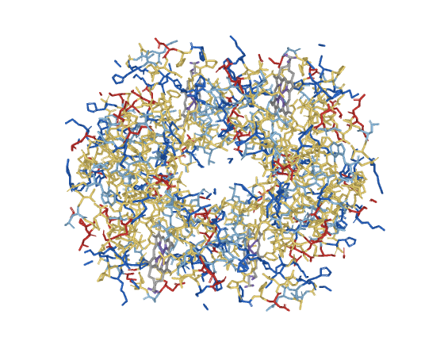 |

### `preset_prot7`

MD box. Cartoon plus water within 4 A and ions within 6 A; bulk solvent discarded.

```
preset_prot7
```

| front | 90 deg | 180 deg |
|---|---|---|
| 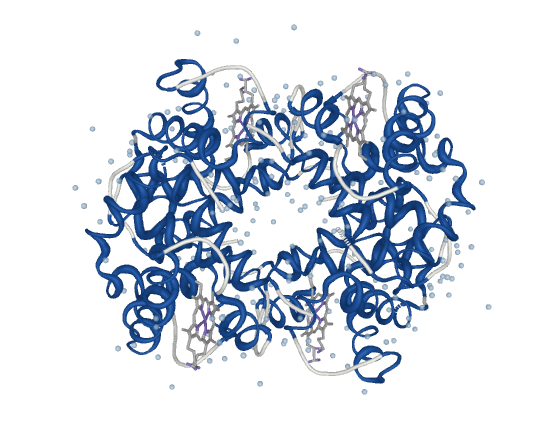 |  | 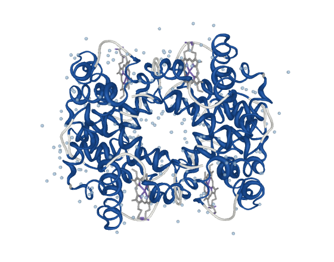 |

### `preset_prot8`

The simulated system as a whole. Surface inside the solvent volume.

```
preset_prot8
```

| front | 90 deg | 180 deg |
|---|---|---|
| 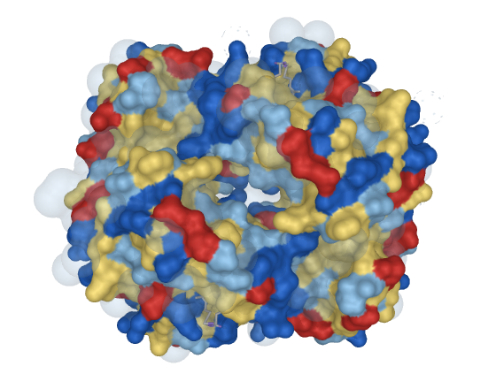 |  | 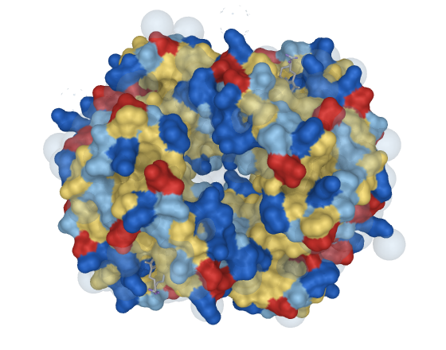 |

### `preset_prot9`

Box dimensions. Surface, solvent field and the twelve box edges, measured into the log.

```
preset_prot9
```

| front | 90 deg | 180 deg |
|---|---|---|
| 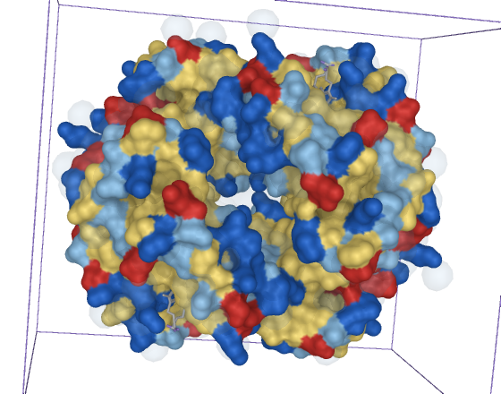 |  | 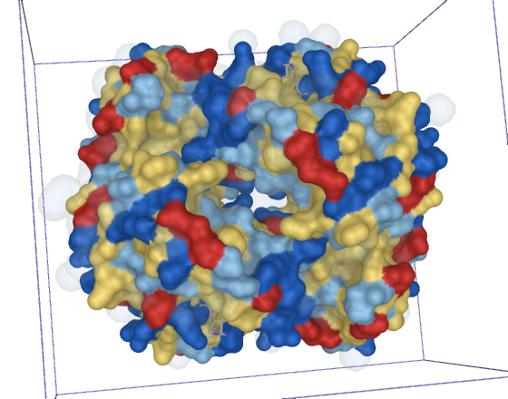 |

### `preset_prot10`

Interface. Translucent cartoon with the contact side chains in opaque licorice, on the chain pair with the largest contact.

```
preset_prot10
```

| front | 90 deg | 180 deg |
|---|---|---|
| 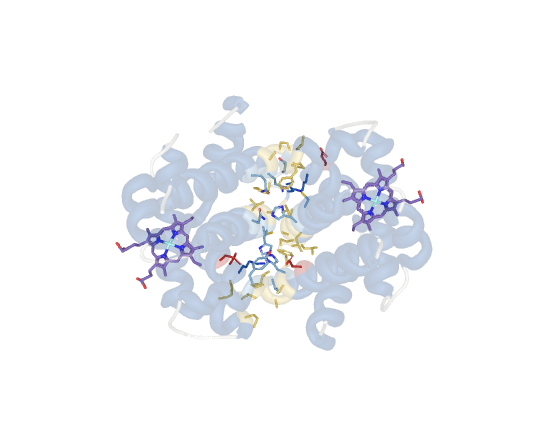 |  | 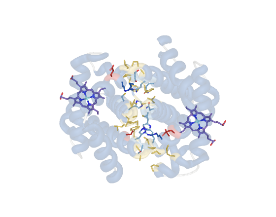 |

## Membrane presets

Rendered from `memb/bilbo_preview.pdb` with the command shown under each row.

```
load memb/bilbo_preview.pdb
run /path/to/pymol-molviz/molviz.pml
```

### `preset_memb1`

General reading. Spheres at scale 0.55, one colour per chemical moiety, water as a translucent surface.

```
preset_memb1
```

| side | top | oblique |
|---|---|---|
| _(pending)_ | _(pending)_ | _(pending)_ |

### `preset_memb2`

Occupied volume. Spacefill at van der Waals radius, coloured by leaflet.

```
preset_memb2
```

| side | top | oblique |
|---|---|---|
| _(pending)_ | _(pending)_ | _(pending)_ |

### `preset_memb3`

Ion to polar head. Licorice with heads as spheres; ions get an opaque core and a solvation shell.

```
preset_memb3
```

| side | top | oblique |
|---|---|---|
| _(pending)_ | _(pending)_ | _(pending)_ |

### `preset_memb4`

Inserted peptide. Translucent surface over thin sticks, water off so it does not cover the target.

```
preset_memb4
```

| side | top | oblique |
|---|---|---|
| _(pending)_ | _(pending)_ | _(pending)_ |

### `preset_memb5`

Illustration and large systems. Tails as a single gaussian isosurface, heads as spheres.

```
preset_memb5
```

| side | top | oblique |
|---|---|---|
| _(pending)_ | _(pending)_ | _(pending)_ |

### `preset_memb6`

Navigation, not a figure. Lines and dots, ambient occlusion off.

```
preset_memb6
```

| side | top | oblique |
|---|---|---|
| _(pending)_ | _(pending)_ | _(pending)_ |

### `preset_memb7`

Cross-section. A central slab in spacefill, with the camera along the cut axis. Takes `eixo`: 0 for x, 1 for y, 2 for z.

```
preset_memb7
```

| side | top | oblique |
|---|---|---|
| _(pending)_ | _(pending)_ | _(pending)_ |

### `preset_memb8`

Annular lipids. The ones touching the protein in licorice, the rest ghosted. Needs a protein in the session.

```
preset_memb8
```

| side | top | oblique |
|---|---|---|
| _(pending)_ | _(pending)_ | _(pending)_ |

### `preset_memb9`

Leaflet asymmetry and thickness. One translucent surface per leaflet, phosphates marking the planes.

```
preset_memb9
```

| side | top | oblique |
|---|---|---|
| _(pending)_ | _(pending)_ | _(pending)_ |

### `preset_memb10`

Print and one-column reduction. Dark tails as isosurface, light heads as spheres, nothing else.

```
preset_memb10
```

| side | top | oblique |
|---|---|---|
| _(pending)_ | _(pending)_ | _(pending)_ |

