# pymol-molviz

Visualization presets for PyMOL, aimed at molecular simulation systems: lipid
bilayers, proteins and peptides. The package splits the loaded system into
independent objects, applies a calibrated material and exposes numbered presets
that combine one representation per component.

Requirements: PyMOL 2.x, open-source or incentive. No external dependencies.

## Getting started

Three steps, in this order: load the system, load the protocol, apply a preset.
The order matters. The protocol splits whatever is already in the session, so
loading it before the structure leaves it with nothing to split.

### 1. Load the system

From the PyMOL command line. One line at a time: the Qt command bar is
single-line, so a multi-line paste becomes one command.

```
load /path/to/membrane.pdb
```

Anything PyMOL reads works the same way: a protein, a membrane, a solvated box,
a single frame of a trajectory.

```
load /path/to/protein.pdb
load /path/to/frame.pdb
```

From the PDB, without a local file:

```
fetch 4HHB, async=0
```

From the menu, `File > Open` does the same thing.

For a molecular dynamics frame, fix the periodic image before opening PyMOL,
or the protein may sit split across the box edges and the solvation shell comes
out empty:

```
gmx trjconv -s topol.tpr -f traj.xtc -o frame.pdb -pbc mol -center -dump 0
```

### 2. Load the protocol

```
run /path/to/pymol-molviz/molviz.pml
```

It splits the system into objects, prints the counts and applies a starting
preset: membrane if lipids are present, protein otherwise. The log names the
version and the directory it loaded from:

```
[molviz] v1.2.0 carregado de /path/to/pymol-molviz/pymol_molviz
```

Running it again always rereads from disk, so it doubles as the way to pick up
an edit. Add the same line to `~/.pymolrc` to have it in every session, and
then this step disappears: opening PyMOL is enough.

### 3. Apply a preset

```
preset_memb1
preset_prot1
```

Ten of each, listed below. Switching preset does not require reloading
anything: the split already happened, and each preset only changes
representation and colour.

Every preset takes an optional `paper` argument, the column width in
millimetres, which makes the scene come out ready for print in the same line:

```
preset_memb5 paper=85
```

Then colour, water and ions are adjustable without leaving the preset:

```
memb_color leaflet
memb_water off
prot_water shell, 6.0
```

And the figure goes out with:

```
mv_render figure.png, 2000, 1500, 300
```

### What the log tells you

Read the counts after step 2. `obj_lipid` with zero atoms means the residue
list does not cover the system; `examples/diagnostico.pml` lists what is
actually in the file. The protocol also reports two things it corrected on the
way in: atoms whose element it had to infer from the atom name, and residue
names that look like ions but are not.

## Install

No install step. Clone or unpack the repository anywhere; `molviz.pml` resolves
its own directory, so it works from any location.

Requirements: PyMOL 2.x or 3.x, open-source or incentive. No external
dependencies.

## Objects

The split produces one object per component, each with its own enable dot in
the side panel.

| Object | Content |
|---|---|
| `obj_lipid` | lipids, subdivided into `lip_head`, `lip_phos`, `lip_glyc`, `lip_tail` |
| `obj_prot` | protein or peptide |
| `obj_wat` | water |
| `obj_ions` | ions |
| `obj_lig` | ligands |
| `obj_nucl` | nucleic acid |

### How the lipid layers are found

`obj_lipid` is split into four layers, and none of them comes from a list of
atom names: nomenclature varies between CHARMM, Berger, Slipids and GROMOS
while the topology does not.

| Layer | Criterion |
|---|---|
| `lip_phos` | phosphorus plus the oxygens bonded to it |
| `lip_head` | nitrogen and its neighbouring carbons, plus whatever sits beyond the phosphate |
| `lip_glyc` | the remaining ester oxygens and the carbons adjacent to them |
| `lip_tail` | the complement |

The head takes three passes, in this order, and each one only fills what the
previous left empty.

**Nitrogen.** Reaches choline and ethanolamine, so PC and PE resolve
chemically. It is also the only pass that works on coarse-grained systems.

**Position.** Phosphatidylglycerol, phosphatidylinositol, phosphatidylserine
and cardiolipin carry no nitrogen at all, and in a mixed system that leaves
most lipids with no head: the layer disappears from the figure and `moiety`
colouring shows three bands instead of four. What defines a polar head is not
its chemistry, which varies by species, but its position: it is the part facing
the solvent, beyond the phosphate. The comparison is per molecule against its
own phosphorus, not against the mean of the leaflet, because with the mean the
molecules sitting deeper than average lose the head entirely. This assumes the
membrane normal along z, the same premise as `memb_color leaflet`.

**Name.** Two cases escape position, and neither is a failure of it: a head
folded inwards is not beyond the phosphate, and the central glycerol of
cardiolipin sits *between* the two phosphates, so it is more internal than they
are by construction. For those there is a CHARMM dictionary, applied per
species and only where fewer than half the molecules were left uncovered. The
log says when it fires.

Measured on a mixed system of 200 lipids across six species plus cardiolipin:

| Passes | Lipids with a head |
|---|---|
| Nitrogen only | 29 per cent |
| Nitrogen and position | 84 per cent |
| All three | 100 per cent |

## Protein presets

Ten presets, rendered below from `prot/4hhb.pdb`, haemoglobin: four chains,
four haems, 221 waters. Every one takes an optional `paper` argument, the
column width in millimetres, which makes the scene come out ready for print in
the same line: `preset_prot3 paper=85`.

```
load prot/4hhb.pdb
run /path/to/pymol-molviz/molviz.pml
```

### `preset_prot1` cartoon by secondary structure

Domain topology.

```
preset_prot1
```

| Element | Representation |
|---|---|
| Protein | cartoon: oval for sheet, automatic for helix, loop elsewhere |
| Colour | helix blue, sheet red, loop white |
| Ligands | sticks, radius 0.22 |
| Ions | spheres, scale 0.45 |
| Water | off |

The only preset that communicates global topology. Cartoon receives no ambient occlusion in PyMOL, so this is the scene with the least contact relief.

| Side | Top |
|---|---|
| 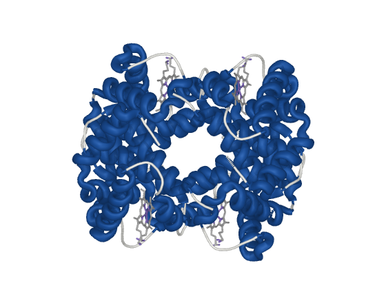 | 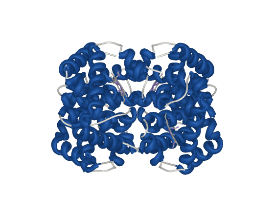 |

### `preset_prot2` cartoon under a ghost surface

Binding site.

```
preset_prot2
```

| Element | Representation |
|---|---|
| Protein | cartoon under a molecular surface at transparency 0.55 |
| Colour | secondary structure |
| Ligands | sticks, radius 0.22, visible through the surface |
| Ions | spheres, scale 0.45 |
| Water | off |

Keeps the molecular outline without losing the fold. An opaque surface would bury the ligand.

| Side | Top |
|---|---|
| 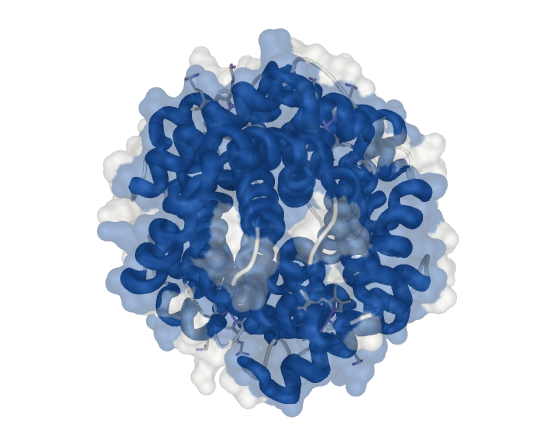 | 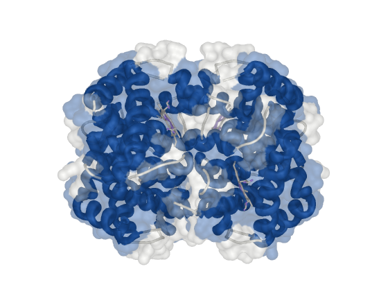 |

### `preset_prot3` solid surface by hydrophobicity

Interaction face, amphipathicity.

```
preset_prot3
```

| Element | Representation |
|---|---|
| Protein | solid molecular surface, solvent radius 1.4 |
| Colour | Kyte-Doolittle gradient |
| Ligands | sticks, radius 0.22 |
| Ions | spheres, scale 0.45 |
| Water | off |

The surface does receive ambient occlusion, so this is the scene with the most relief. It writes to the B-factor column; `prot_restore_b` puts the original values back.

| Side | Top |
|---|---|
| 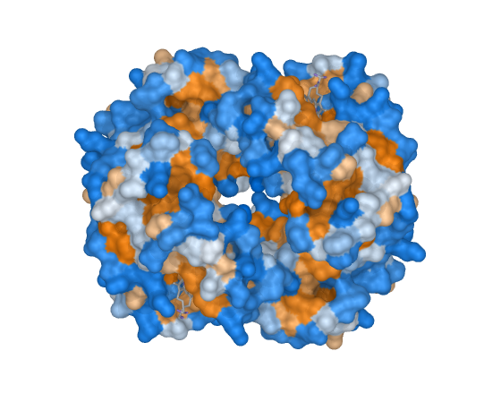 | 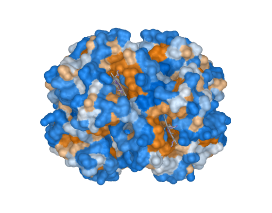 |

### `preset_prot4` spacefill by chain

Complex architecture.

```
preset_prot4
```

| Element | Representation |
|---|---|
| Protein | spheres at van der Waals radius, scale 1.0 |
| Colour | one per chain, from an eight-colour cycle |
| Ligands | spheres at van der Waals radius |
| Ions | spheres, scale 0.45 |
| Water | off |

Occupied volume and packing. In a multi-chain complex this is the most direct way to show the arrangement of the assembly.

| Side | Top |
|---|---|
| 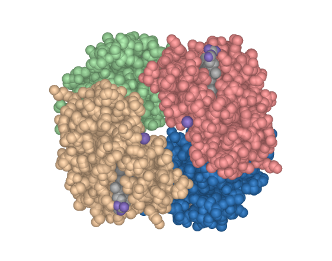 | 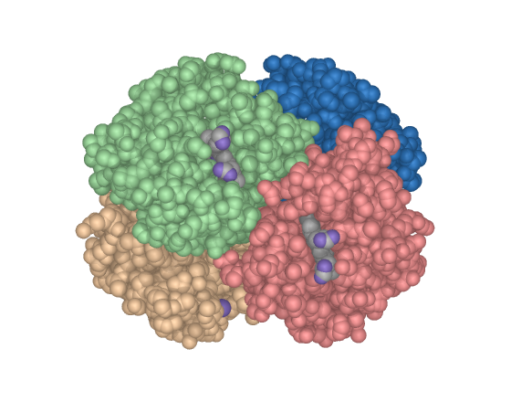 |

### `preset_prot5` putty by b-factor

Flexibility.

```
preset_prot5
```

| Element | Representation |
|---|---|
| Protein | cartoon in putty mode, thickness 0.6 to 3.5, radius 0.35 |
| Colour | B-factor as deposited |
| Ligands | sticks, radius 0.22 |
| Ions | spheres, scale 0.45 |
| Water | off |

Thickness encodes the B-factor: a flexible region comes out thick and red. Valid for experimental structures. On a predicted model the B column usually carries pLDDT, whose scale means the opposite.

| Side | Top |
|---|---|
| 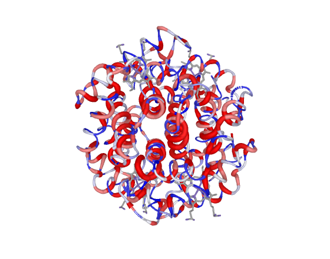 | 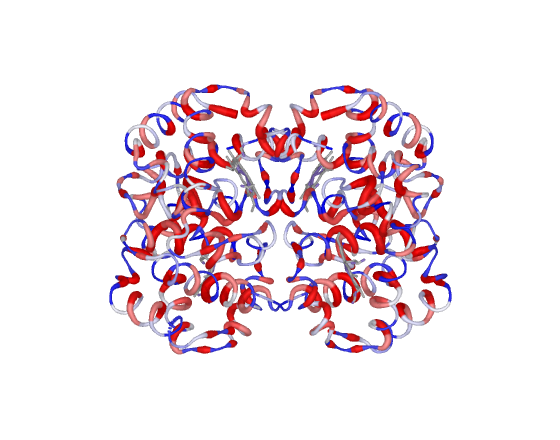 |

### `preset_prot6` all-atom licorice by charge

Peptides.

```
preset_prot6
```

| Element | Representation |
|---|---|
| Protein | all-atom sticks, radius 0.20, side chain helper off |
| Colour | basic blue, acidic red, polar light blue, apolar yellow |
| Ligands | sticks, radius 0.22 |
| Ions | spheres, scale 0.45 |
| Water | off |

For peptides, where cartoon says little: there is no global topology to summarise and the information is in the side chain. Above 60 residues it warns and the scene becomes an illegible mass.

| Side | Top |
|---|---|
| 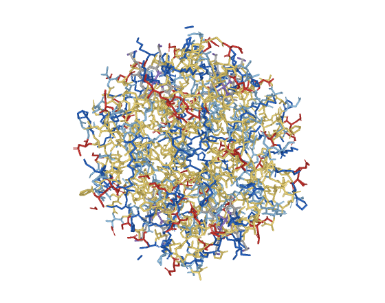 | 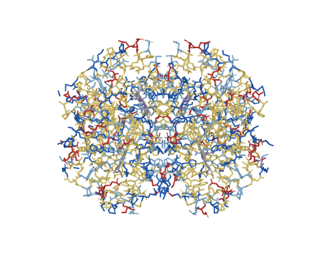 |

### `preset_prot7` solvated system

MD box, solvation shell.

```
preset_prot7
```

| Element | Representation |
|---|---|
| Protein | cartoon, oval sheet and loop |
| Colour | secondary structure |
| Water | only within 4.0 A of the protein, selected by `byres` |
| Ions | only within 6.0 A of the protein |
| Ligands | sticks, radius 0.22 |

Discards bulk water and ions, which in a typical box are more than 90 per cent of the atoms and hide the solute entirely. Takes the shell radius: `preset_prot7 6.0`.

| Side | Top |
|---|---|
| 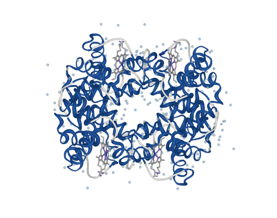 | 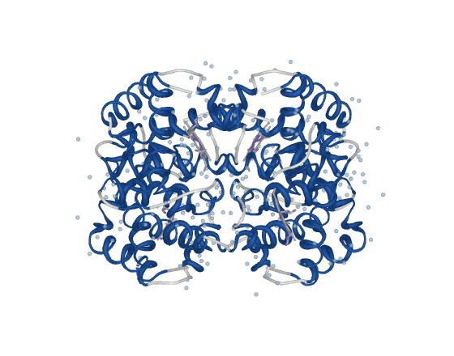 |

### `preset_prot8` full box

The simulated system as a whole.

```
preset_prot8
```

| Element | Representation |
|---|---|
| Protein | molecular surface |
| Colour | formal charge |
| Water | surface at transparency 0.72, inflated oxygen radius |
| Ions | opaque core with a translucent solvation shell |
| Ligands | sticks, radius 0.22 |

Illustrates box dimensions and the solute to solvent ratio. It does not serve to analyse the protein: the solvent volume covers it by construction.

| Side | Top |
|---|---|
| 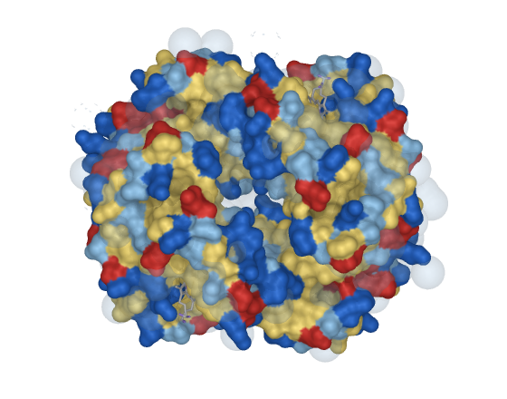 | 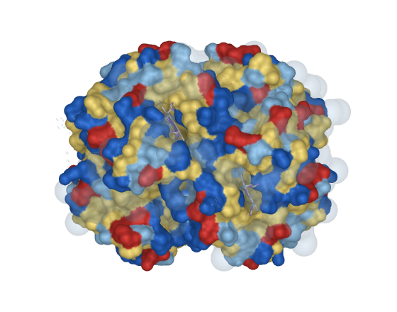 |

### `preset_prot9` simulation box, measured

Box dimensions.

```
preset_prot9
```

| Element | Representation |
|---|---|
| Protein | molecular surface |
| Colour | formal charge |
| Water | gaussian field at transparency 0.82 |
| Ions | spheres, scale 0.45 |
| Box | twelve edges drawn as lines, from the extent of what is loaded |

The box comes from the extent of the loaded system rather than a CRYST1 record, which MD frames often lack. It prints the dimensions to the log, ready for the caption.

| Side | Top |
|---|---|
| 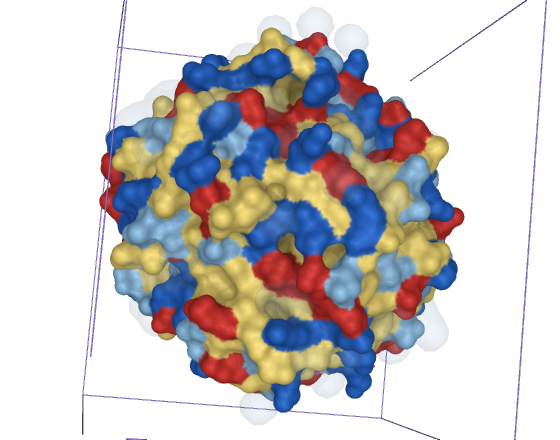 | 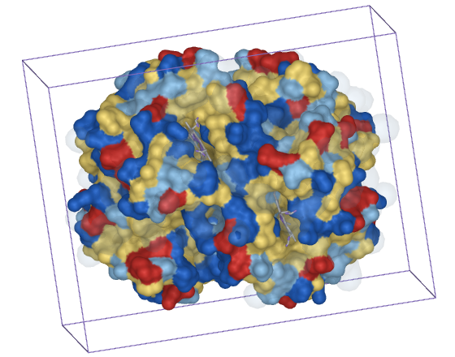 |

### `preset_prot10` interface in licorice

Where two chains, or protein and ligand, touch.

```
preset_prot10
```

| Element | Representation |
|---|---|
| Protein | cartoon at transparency 0.72, side chain helper on |
| Colour | secondary structure |
| Contacts | side chains in opaque sticks, radius 0.20 |
| Contact colour | carbon by residue class, everything else by element |
| Ligands | sticks, radius 0.24, own carbon colour |
| Water | off |

With more than two chains it shows the pair with the largest contact and hides the rest: a tetramer puts three different interfaces in one frame and none of them reads. Takes the pair: `preset_prot10 cadeias=A C`. Surface is the wrong representation here, because a closed surface hides the contact area, which sits between the two parts.

| Side | Top |
|---|---|
| 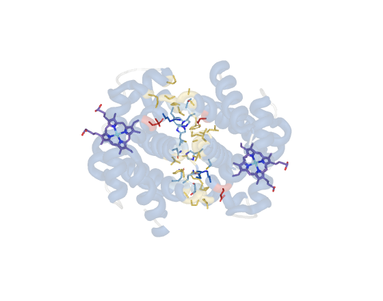 | 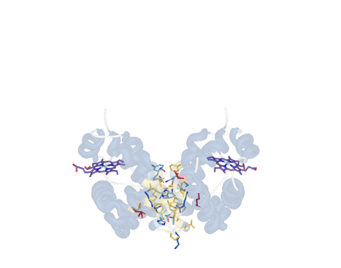 |

## Membrane presets

Ten presets, rendered below from `memb/bilbo_preview.pdb`: a mixed bilayer of
six lipid species plus cardiolipin, 64k atoms, written with a zero B column,
which is what a molecular dynamics frame looks like. The `paper` argument works
the same way here.

```
load memb/bilbo_preview.pdb
run /path/to/pymol-molviz/molviz.pml
```

### `preset_memb1` stratified spheres

General reading, layer organization.

```
preset_memb1
```

| Element | Representation |
|---|---|
| Lipid | spheres, scale 0.55, heads at 0.66 |
| Colour | one per chemical moiety: head, phosphate, glycerol, tail |
| Ions | opaque spheres, scale 0.5 |
| Water | molecular surface at transparency 0.62 |

The gap between spheres is what preserves the distinction between the four layers, which a full spacefill erases.

| Side | Top |
|---|---|
| 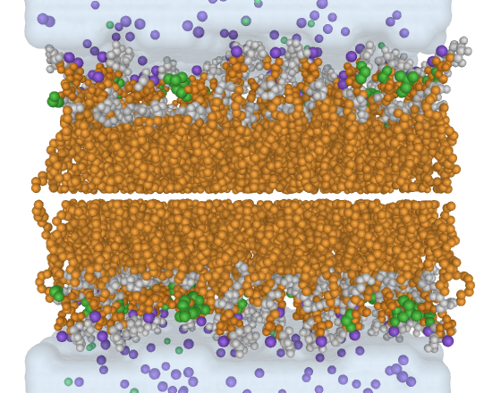 | 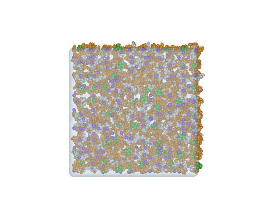 |

### `preset_memb2` solid spacefill

Occupied volume, the barrier.

```
preset_memb2
```

| Element | Representation |
|---|---|
| Lipid | spheres at van der Waals radius, scale 1.0 |
| Colour | one per leaflet |
| Ions | spheres at real radius, consistent with the lipid |
| Water | molecular surface at transparency 0.78 |

Shows occupied volume and packing. Internal organization disappears by construction: what you see is the barrier.

| Side | Top |
|---|---|
| 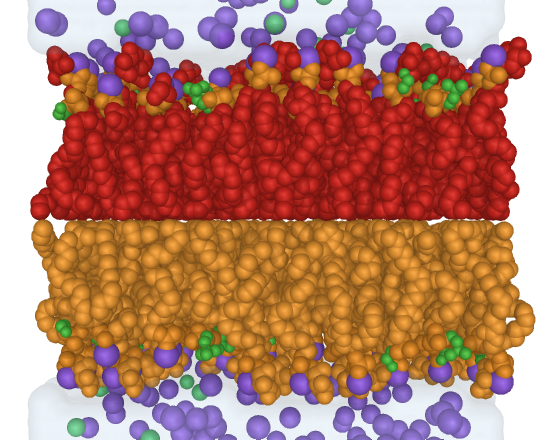 | 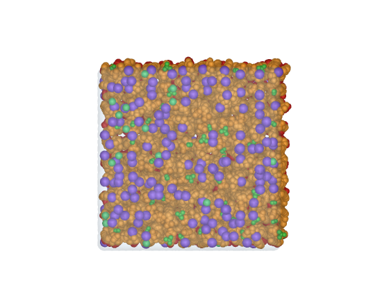 |

### `preset_memb3` licorice with highlighted ions

Ion to polar head interaction.

```
preset_memb3
```

| Element | Representation |
|---|---|
| Lipid | sticks, radius 0.30, heads as spheres at 0.45 |
| Colour | one per chemical moiety |
| Ions | opaque core with a translucent shell at 0.72, suggesting solvation |
| Water | translucent spheres, scale 0.35 |

Licorice lets the tail conformation show, which spacefill hides.

| Side | Top |
|---|---|
| 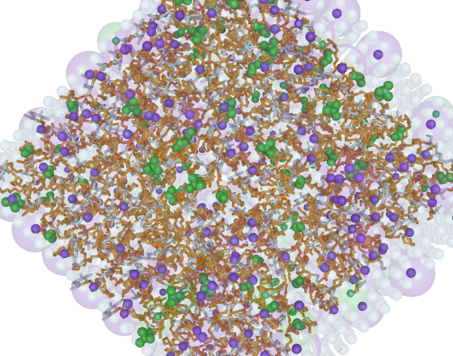 | 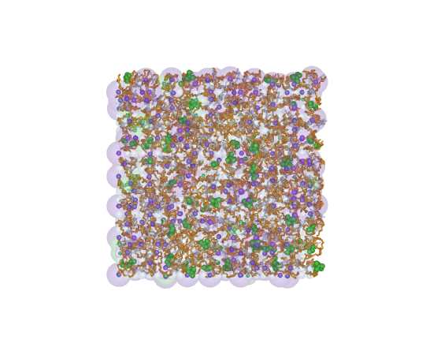 |

### `preset_memb4` ghost bilayer

Inserted peptide.

```
preset_memb4
```

| Element | Representation |
|---|---|
| Lipid | molecular surface at transparency 0.58 over thin sticks, radius 0.16 |
| Colour | one per chemical moiety |
| Ions | spheres with an inflated mesh, radius 3.0 |
| Water | off, deliberately |
| Protein | shown if present |

Preserves the membrane outline without hiding what is inside it. The water is off on purpose: the solvent surface would cover the object of interest.

| Side | Top |
|---|---|
| 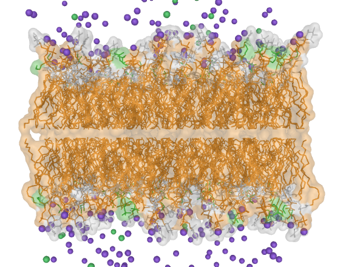 | 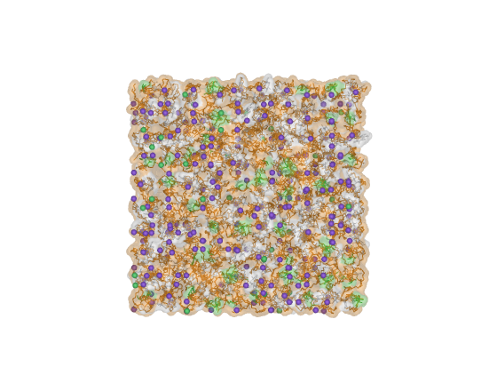 |

### `preset_memb5` continuous hydrophobic core

Illustration, large systems.

```
preset_memb5
```

| Element | Representation |
|---|---|
| Lipid | tails as a single gaussian isosurface, heads and phosphates as spheres at 0.75 |
| Colour | tail orange, head green, phosphate amber |
| Ions | opaque spheres, scale 0.85 |
| Water | continuous gaussian field |

Replaces thousands of tail atoms with one smooth surface. Lightest preset for large systems and the closest to scientific illustration. The isolevel comes from the map histogram, not a fixed value, and it falls back to thin sticks if the map comes out empty.

| Side | Top |
|---|---|
| 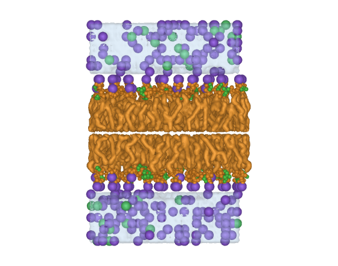 | 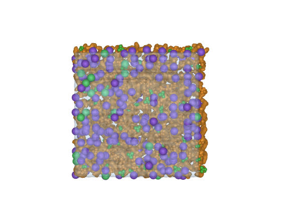 |

### `preset_memb6` fast navigation

Not a figure.

```
preset_memb6
```

| Element | Representation |
|---|---|
| Lipid | lines, width 1.2 |
| Colour | one per lipid species |
| Ions | dots |
| Water | off |
| Ambient occlusion | off |

Exists because ray tracing and ambient occlusion make rotation unusable on a large system. Frame the scene here, then apply an expensive preset.

| Side | Top |
|---|---|
| 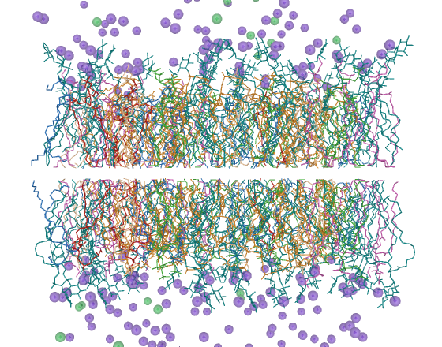 | 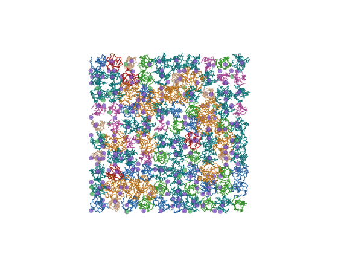 |

### `preset_memb7` cross-section

The bilayer interior.

```
preset_memb7
```

| Element | Representation |
|---|---|
| Lipid | central slab in spacefill, scale 1.0 |
| Colour | one per chemical moiety, exposed on the cut face |
| Ions | spheres within 8 A of the slab |
| Water | off |
| Camera | along the cut axis |

The cut is a coordinate selection, not the camera clipping plane, so rotating afterwards does not change what is exposed. Takes the axis: `preset_memb7 0` for x, `1` for y, `2` for z.

| Side | Top |
|---|---|
| 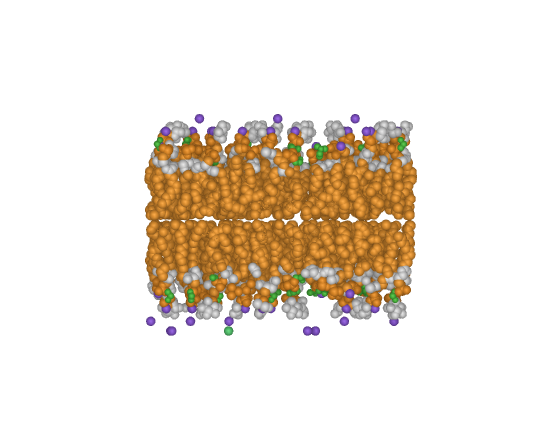 | 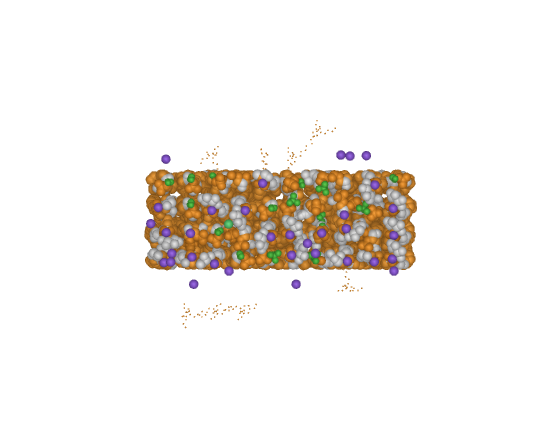 |

### `preset_memb8` annular lipids

Protein to lipid contact.

```
preset_memb8
```

| Element | Representation |
|---|---|
| Lipid in contact | licorice, radius 0.24, opaque |
| Rest of the bilayer | sticks, radius 0.10, transparency 0.72 |
| Colour | contacts by moiety, the rest neutral grey |
| Ions | small spheres, scale 0.4 |
| Water | off |

Answers which lipids touch the protein. Needs a protein in the session, and takes the contact radius: `preset_memb8 7.0`.

| Side | Top |
|---|---|
| 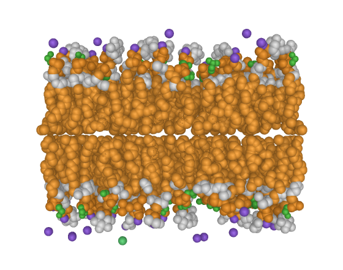 |  |

### `preset_memb9` separated leaflets

Leaflet asymmetry and thickness.

```
preset_memb9
```

| Element | Representation |
|---|---|
| Upper leaflet | molecular surface at transparency 0.45 |
| Lower leaflet | molecular surface, second colour |
| Phosphates | spheres, scale 0.55, marking both planes |
| Ions | spheres, scale 0.5 |
| Water | off |

The two surfaces let the separation between the phosphate planes be read by eye, and a composition difference between leaflets shows up as a volume difference. The midplane comes from the mean z of the phosphates.

| Side | Top |
|---|---|
| 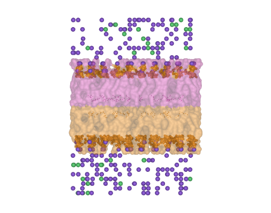 | 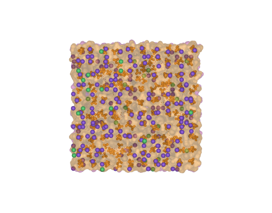 |

### `preset_memb10` two colours, for print

Reduction to one column, black and white.

```
preset_memb10
```

| Element | Representation |
|---|---|
| Lipid tails | gaussian isosurface, dark |
| Heads and phosphates | spheres, scale 0.8, light |
| Ions | off |
| Water | off |

Two colours only, separated by lightness rather than hue, and nothing secondary competing for attention. Everything that is not the bilayer leaves the scene.

| Side | Top |
|---|---|
| 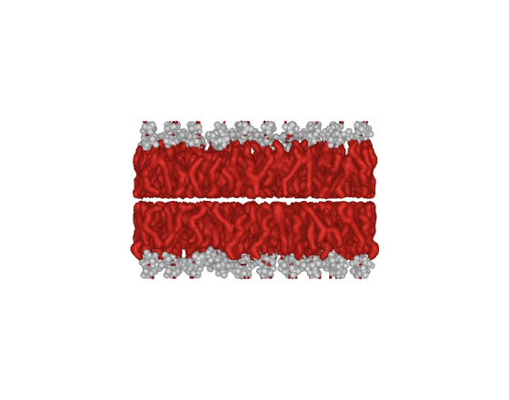 | 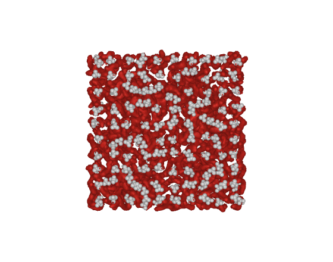 |

## Colour, water and ions

```
memb_color   moiety | leaflet | type | depth
memb_water   off | surface | spheres | field
memb_split
memb_protein
prot_color   ss | chain | charge | hydro | bfactor | rainbow
prot_water   off | shell | spheres | surface | field
prot_ions    off | spheres | vdw | halo | mesh | shell
prot_split
prot_auto
prot_restore_b
```

`shell` exists in the protein module only. It shows water or ions within a
radius of the solute, selected by `byres`.

## Material, lighting and output

```
mv_material
mv_ao          off | soft | medium | strong | extreme
mv_shadows     off | soft | medium | hard
mv_realism     studio | depth | dramatic | flat
mv_desaturate  0.18
mv_paper       85
mv_grayscale   1
mv_extent      obj_lipid
mv_render      figure.png, 2000, 1500, 300
mv_reload
```

`mv_reload` re-imports the package from disk. Running `molviz.pml` again does
not: `import` finds the package already in `sys.modules` and hands back what is
in memory, so an edit appears to have no effect and a preset keeps printing the
previous version's message.

Ambient occlusion is on in every preset except `preset_memb6`, which turns it
off to keep navigation responsive. `ambient_occlusion_scale` is the sampling
distance in angstrom; PyMOL defaults to 25, which is calibrated for spheres and
saturates on a protein surface, where wide cavities come out as black patches.
The levels here sample between 8 and 22. Measured in both regimes: on membrane
spheres 12 and 25 render indistinguishably, and on a surface only the lower
value is usable. It does not reach cartoon: PyMOL bakes it
into sphere and surface geometry only, so a cartoon-based preset carries no
contact relief.

Each level sets several parameters at once. `mv_realism` overrides
`mv_shadows`, which overrides `mv_ao`: apply them from general to specific.
`mv_paper` takes a column width in millimetres, turns off cast shadows, sets
orthoscopic projection and prints the target resolution.

`mv_grayscale` rewrites every named colour in use to its own BT.601 luminance
and puts the originals back on the way out. PyMOL has no grayscale setting, so
a gradient applied by `spectrum` stays coloured and the log says how many
colours it could not reach.

## Rebuilding the images

The figures above come from the two systems in this repository. To regenerate
them after changing a preset:

```
/Applications/PyMOL.app/Contents/MacOS/PyMOL -cq tests/make_gallery.py
```

It renders each preset from the side and from the top, in orthoscopic
projection, and skips what already exists in `docs/img`, so it can be
interrupted and resumed. Delete the files you want redone.

Framing is set per system, because the two shapes are different: a bilayer is
wide and thin and fills the width of the frame, so it takes a 6 A margin, while
a globular protein takes 3 A or it would come out too small to show detail.
Both use `complete=1`, which is what guarantees the geometry is not clipped.

## Tests

```
/Applications/PyMOL.app/Contents/MacOS/PyMOL -cq tests/run_presets.py
```

Runs all twenty presets against four synthetic systems and checks that
B-factors survive, `gaussian_resolution` is restored, promised surfaces exist
and ambient occlusion lands where it should. See [`tests/`](tests/).

## Documentation

Written in Portuguese.

| File | Content |
|---|---|
| [`passo-a-passo.md`](passo-a-passo.md) | Numbered flows, command by command. Start here. |
| [`presets.md`](presets.md) | What each preset shows and which question it answers. |
| [`limitacoes.md`](limitacoes.md) | PyMOL limitations and common problems, with cause and fix. |
| [`adaptacao.md`](adaptacao.md) | Where to edit for another force field, scale or new preset. |
| [`decisoes.md`](decisoes.md) | Design decisions and the constraint behind each one. |

## Layout

```
pymol-molviz/
├── molviz.pml              # entry point
├── pymol_molviz/
│   ├── __init__.py         # command registration and system detection
│   ├── core.py             # palette, material, lighting, output
│   ├── membrane.py         # six membrane presets
│   └── protein.py          # eight protein presets
├── docs/
├── examples/               # ready sequences, run with @
└── legacy/                 # earlier scripts, unmaintained
```

## Examples

```
@/path/to/pymol-molviz/examples/figura_membrana.pml
@/path/to/pymol-molviz/examples/figura_peptideo.pml
@/path/to/pymol-molviz/examples/md_solvatada.pml
@/path/to/pymol-molviz/examples/diagnostico.pml
```

`diagnostico.pml` draws nothing. It lists residue names, atom names and the
atoms per residue ratio, to identify the nomenclature of an unknown system.

## License

MIT.
